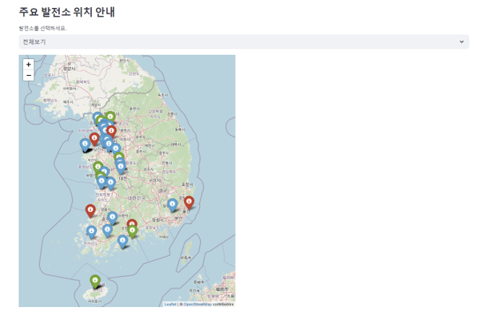
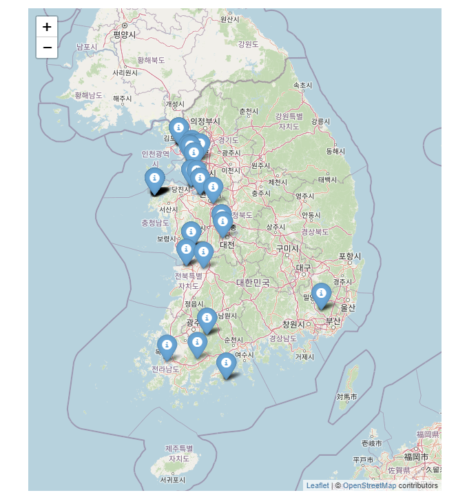
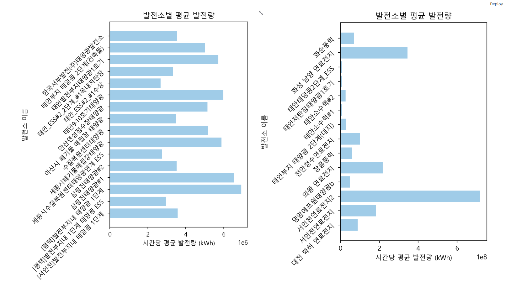

# Data_DashBoard

# 신재생 에너지 발전소 현황 및 최근 발전량 분석
---
- **신재생에너지란** :
    - 화석연료의 고갈과 환경규제에 대응하기 위한 청정에너지 비중 확대되며 주목받는 미래 산업 중 하나
  
- **배경** :
    - 전세계적으로 탄소중립 정책과 신재생에너지의 중요성이 대두되면서 국내에서도 ESG경영 트렌드에 맞춘 탄소 중립 실현 기업이 증가하고 있습니다
    
    > “한국지역난방공사는 12일 “삼성전자와 ‘반도체·집단에너지 산업 간 에너지 수급 효율화 및 저탄소화 협약’을 체결했다”며 이같이 밝혔다.
    이번 협약은 탄소 감축 등 친환경 경영에도 이바지할 것으로 기대되고 있다.”

    > “현대건설이 재생에너지 공급망 확보에 나서는 등 민간 전력거래시장에서 견고한 입지를 다지고 있다.
    현대건설은 글렌몬트디앤디솔라홀딩스(이하, 글렌몬트디앤디)와 종로구 계동에 위치한 현대건설 본사에서 태양광 재생에너지 공급을 위한 전력구매계약(PPA)을 체결했다고 12일 밝혔다.”

    > “차성수 경기도 기후환경에너지국장은 “국내·외적인 경제난 속에서도 재생에너지 시장이 위축되지 않도록 금융 지원을 확대하고 RE100 기업들의 수출경쟁력을 확보하겠다.”라고 말했다.”

- **목적**
    - 신재생에너지 전력거래량을 제공하고 발전소별 발전량과 이용량의 추이를 분석하여 신재생에너지 활용을 높이고자 합니다.
   
- **개요** :
    - 신재생에너지의 발전량과, 발전소의 위치 정보를 제공하는 데이터 대시보드
 
- **데이터** :
    - 신재생에너지 항목별 전력 거래량,
    - 한국서부발전 일간 발전량,
    - 한국중부발전 일간 발전량,
    - 한국동서발전 일간 발전량
 
- **기능**
    - 지도에서 발전소 위치 정보 확인
    - 에너지원 별 전력 거래량 그래프
    - 발전소별 발전량 그래프

---
**streamlit app deploy**
> https://energyboard.streamlit.app/

---
## 대시보드 내 세부 기능 미리보기 
- **에너지원별 신재생에너지 파이차트와 연도별 전체 전력량**

- **에너지원별 신재생에너지 파이차트와 연도별 전체 전력량**

- **발전소 위치 및 시간대별 발전량**

- **발전소 위치 및 시간대별 발전량**

- **발전소 위치 및 시간대별 발전량**

- **발전소 위치 및 시간대별 발전량**

- **발전소 위치 및 시간대별 발전량**

